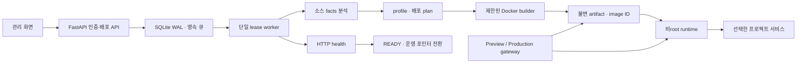

# Campus Deploy 기능 및 기술 상세 명세

기준: 2026-10-08. 공개 GitHub/ZIP 소스를 Docker에서 빌드·실행하고 배포 상태, Preview/운영, 롤백과 복구를 관리하는 자체 호스팅 플랫폼입니다. 신뢰된 팀의 시연·개발 검증용 MVP이며 범용 상용 PaaS나 Vercel 전체 기능을 구현한 제품은 아닙니다. 실제 통과 결과와 미검증 항목은 [VERIFICATION.md](VERIFICATION.md)를 함께 확인합니다.

## 1. 사용자 기능

| 기능 | 입력과 동작 | 결과 및 제한 |
|---|---|---|
| 관리자 로그인 | 로컬 생성 암호, 세션·CSRF·Origin 검증 | 단일 운영자; 공개 회원가입/다중 사용자 권한 없음 |
| 공개 GitHub 가져오기 | 저장소 루트 HTTPS 주소 → 기본 branch/commit 조회 → SHA 고정 archive | PAT 불필요; private Git/submodule/LFS 미지원 |
| ZIP 업로드 | 파일 수·압축 해제 크기·경로·링크 검사, 단일 감싸는 폴더 정규화 | 50MiB 업로드, 200MiB 소스, 10,000 files |
| 지원 유형 검사 | 소스 facts 분석 → 지원 profile/배포 plan 확정 | 모호하면 manifest 요구, 추측해서 실행하지 않음 |
| 프로젝트 생성 | 이름과 slug 지정; Git URL에서 기본값 자동 생성 | 첫 성공 배포만 자동 Production |
| 새 버전 배포 | 별도의 deployment ID, 소스 SHA, 설정 snapshot | 기존 운영을 유지한 채 Preview 준비 |
| 배포 관찰 | 실제 단계, 시간, 오류, 종료 코드, build/runtime 로그 | 가상 진행률 없음; 로그별 2MiB 저장 제한 |
| 사이트 접속 | `p-<slug>` 운영, `d-<id>` Preview 주소 | 기본 localhost:8080, 외부 공개 설정 별도 |
| 운영 반영 | READY 배포의 runtime 재검사 → 트랜잭션 포인터 변경 | 실패하면 기존 운영 유지 |
| 코드 롤백 | 과거 운영 이력의 READY 산출물/이미지 재사용 | Git/npm/Gradle/Maven 재빌드 없음; DB 복원 아님 |
| 취소/삭제 | 큐 작업 취소, 프로젝트 소유 자원 정리 | 프로젝트 삭제는 해당 서비스 데이터도 영구 삭제 |
| 재시작 복구 | 영속 큐·lease 복구, 운영 runtime/선택 서비스 재생성 | 이미지·볼륨·자격증명 보존 필요 |

## 2. 지원 프로필

| 프로필 | 소스 계약 | 빌드 | 제공 방식 |
|---|---|---|---|
| STATIC | 루트 index.html, HTML/CSS/클라이언트 JS | npm 실행 없음 | immutable 정적 파일 |
| VITE_STATIC | npm lockfile v2/v3, Vite, build script | Node 24: npm ci + npm run build | dist, SPA HTML fallback, JS/CSS MIME |
| NODE_SERVER | npm lockfile v2/v3, scripts.start, PORT/0.0.0.0 | npm ci, 선택 build, 이미지 생성 | npm start, HTTP 프록시; DB/Redis 없는 앱 |
| SPRING_BOOT_JAR | Java 21 단일 모듈 Gradle/Maven Wrapper, Spring Boot | gradlew bootJar 또는 mvnw package | JRE + 실행 JAR, 모든 HTTP 경로 프록시 |
| SPRING_BOOT_VITE | Java 21/Gradle + 별도 Vite/npm lockfile | 기존 고정 Gradle + Vite 빌드 | 정적 프런트 + Java API/업로드 프록시 |

기존 `SPRING_BOOT` 저장 행은 Vite 호환 경로로 유지합니다. 일반 JAR에는 frontend/package.json/npm lockfile이 필요하지 않습니다. Gradle `*-plain.jar`를 제외하고 Boot 실행 구조가 있는 JAR을 하나로 확정해야 합니다. 여러 개면 manifest artifact를 요구합니다.

## 3. 분석·선언형 배포 계획

주요 관리 API는 다음과 같습니다. 로그인/health를 제외한 API는 관리자 세션이 필요합니다. 로그인은 Origin, 인증 후 변경 요청은 Origin·CSRF를 검사합니다. 주요 작업 생성 API는 Idempotency-Key로 중복을 방지합니다.

| API | 역할 |
|---|---|
| POST /api/login, POST /api/logout | 로그인·세션 폐기 |
| GET /api/health | 관리 API 및 worker heartbeat |
| POST /api/sources/git, POST /api/sources/zip | 소스 검사 작업 생성 |
| GET /api/sources/{id} | 검사 상태·SHA·profile·analysis·plan |
| POST/GET /api/projects, GET /api/projects/{id} | 프로젝트 생성·목록·배포 이력 |
| POST /api/projects/{id}/deployments | 선택 소스의 새 불변 배포 생성 |
| GET /api/deployments/{id}, GET /api/deployments/{id}/logs | 배포 상태/settings/validation 및 cursor 로그 |
| POST /api/projects/{id}/production, GET /api/operations/{id} | promote/rollback 및 비동기 완료 상태 |
| POST /api/deployments/{id}/cancel | 진행 중 배포 취소 |
| DELETE /api/projects/{id}, GET /api/cleanup/{id} | 소유 자원 삭제 요청·완료 상태 |

변경 전 오류의 원인은 Spring Boot 감지와 aurashop형 프런트 조건이 하나의 검사 함수에 결합된 것이었습니다. frontend가 없는 정상 REST API도 Vite 누락으로 거절했습니다.

현재 분석은 `spring_plan.py`에서 backend roots, Spring Boot 여부, build tool, wrapper/누락 파일, frontend roots/Vite/npm lock, multi-module/WAR, 서비스 dependency hints를 기록합니다. 별도의 계획 단계는 facts와 선택 manifest로 profile/root/artifact/health/services를 확정합니다. dependency hint는 서비스 생성 권한이 아닙니다.

`campus-deploy.yaml`은 version 1/runtime spring-boot만 지원합니다. 주요 키는 root, java=21, buildTool, artifact, port=8080, health.path, services.mysql/redis/storage.enabled, storage.mountPath입니다. 선택 profile/frontend.root로 모호한 구성을 지정할 수 있습니다. 허용 목록 밖 명령/키, shell 문자열, traversal, host mount, YAML 태그·별칭·중복 키는 거부합니다. 전체 문법과 예시는 [SPRING_BOOT.md](SPRING_BOOT.md)에 있습니다.

검사 facts/plan은 sources 테이블에 저장하고 배포 settings에 snapshot으로 복사합니다. 빌드 직전 보존 소스의 재분석 결과와 비교합니다. 일반 JAR의 Java/JS/application.yml을 자동 수정하지 않습니다.

## 4. 서비스와 영속 데이터

| 항목 | 생성 조건 | 수명과 연결 |
|---|---|---|
| MySQL | JAR manifest enabled 또는 기존 Vite 기본값 | 프로젝트 전용 계정/볼륨/internal data network |
| Redis | JAR manifest enabled 또는 기존 Vite 기본값 | 프로젝트 암호/AOF 볼륨/internal data network |
| 파일 storage | JAR manifest enabled 또는 기존 Vite 기본값 | 프로젝트 명명 볼륨; 기본 /app/uploads, /app 아래 경로 선택 |
| 앱 runtime/image | 배포별 | image ID/SHA 고정; 운영 및 최신 Preview 실행 유지 |
| 소스/로그/메타데이터 | 설치 영속 볼륨 | 배포 이력과 복구에 사용 |

Preview와 Production은 선택한 프로젝트 서비스를 공유합니다. Preview의 쓰기가 운영 데이터에도 보이며 코드 롤백은 DB 데이터·스키마를 되돌리지 않습니다. 일반 JAR MySQL에는 Hibernate validate를 주입합니다. 기존 Vite는 첫 운영 전 update/이후 validate를 유지합니다. 애플리케이션 자체 SQL 쓰기나 자체 migration의 안전성까지 보장하지 않습니다.

자격증명은 프로젝트별로 생성해 별도 서비스 secret 파일에 보존하고 재시작/롤백에 재사용합니다. MySQL root 암호는 앱에 전달하지 않습니다. 생성 비밀의 정확한 문자열을 로그에서 마스킹합니다. DB 볼륨과 자격증명은 함께 백업해야 하며 자동 백업·복원은 미구현입니다.

## 5. 실행·건강 상태·복구

STATIC/Vite는 HTML과 로컬 자원 응답·MIME을 검사합니다. Node는 `/` 2xx와 process 생존을 확인합니다. Spring은 명시 health 경로의 2xx를 요구합니다. 일반 JAR의 health 미지정 기본값은 `/`의 2xx 또는 404를 허용하고 **HTTP 연결만 확인한 상태**를 UI·로그·validation에 기록합니다. 이것을 앱 전체 기능 검증으로 표시하지 않습니다. Actuator 의존성은 hint이며 경로 노출을 확정하지 못하면 자동 선택하지 않습니다.

runtime process 종료와 exit code, 연결 실패, timeout, HTTP 오류를 구분합니다. health 실패 시 READY/운영 포인터를 변경하지 않습니다. 롤백은 보존한 image ID로 runtime 재생성 후 health를 재검사합니다. startup과 idle worker 점검에서 운영 runtime과 선택 서비스를 복원합니다. 복원 실패 시 UNAVAILABLE/503과 원인을 표시하며 포인터·이미지·데이터를 보존합니다.

## 6. 구현에 사용한 기술과 역할

| 기술 | 저장소 기준 버전/설정 | 담당 역할 |
|---|---|---|
| React / TypeScript / Vite | 19.3.0 / 7.0.2 / 8.3.3 | 한국어 관리 UI, 폼·배포 목록·로그·운영 전환, production 빌드 |
| Python / FastAPI / Uvicorn | 플랫폼 이미지 3.13.2 / 0.142.2 / 0.34.2 | 관리 API, 인증 미들웨어, gateway, worker |
| SQLite WAL | 영속 Compose metadata 볼륨 | sources/projects/deployments/jobs/operations/transitions/logs/세션 |
| Docker Engine SDK | docker Python 7.1.0 | 제한된 builder, archive 회수, 이미지 생성, runtime·서비스·라벨 정리 |
| Docker Compose | 기존 api/gateway/worker 3개 서비스 | control-plane 네트워크·볼륨·시작 순서·건강 상태 |
| HTTPX | 0.28.1 | GitHub 조회, 내부 health, HTTP reverse proxy, 검증 클라이언트 |
| Argon2 / itsdangerous | 23.1.0 / 2.2.0 | 암호 해시, 서명된 세션과 서버 측 세션 폐기 |
| PyYAML | 6.0.3 + 제한된 SafeLoader | 선택 manifest 파싱, 중복/별칭/태그/허용 키 검사 |
| Java / Gradle Wrapper / Maven Wrapper | Java 21; 사용자 Wrapper 버전 | 일반 Spring 실행 JAR 빌드; 임의 build command 없음 |
| Gradle JDK builder / Temurin JRE | 9.4.1-jdk21 / 21.0.10_7-jre-jammy | Java 빌드 환경과 분리된 JRE 실행 이미지 |
| MySQL / Redis | 8.4.8 / 7.4.8-alpine | 선택한 프로젝트의 관계형 DB·캐시/세션 |
| pytest / Playwright Chromium | 8.3.5 / 1.63.0 | 자동 회귀, 실제 브라우저 조작, 화면/API/실행 검증 |
| Git / GitHub | 소스 SHA 및 원격 저장소 | 구현 코드 공유, 앱 소스 수집과 버전 식별 |

플랫폼 자체 백엔드는 Python입니다. 사용자가 올리는 Python 앱의 배포 지원과는 다른 의미입니다. 버전은 이 저장소에 고정된 값이며 최신 버전 권장 목록이 아닙니다.

## 7. 자원·보안 경계

| 대상 | 제한 |
|---|---|
| builder | uid/gid 1000, 1 CPU/2GiB/256 PID, readonly root, cap-drop/no-new-privileges, 작업 tmpfs 1GiB, 기본 600초 |
| Node runtime | 0.5 CPU/512MiB/128 PID, readonly root, /tmp 64MiB |
| Java runtime | 0.5 CPU/1GiB/128 PID, readonly root, /tmp 64MiB 및 선택 volume |
| MySQL / Redis | 각각 0.5 CPU/128 PID; 768MiB / 192MiB |
| HTTP 프록시 | request 2MiB, response 50MiB, WebSocket 미지원 |
| 관리/사이트 포트 | 기본 127.0.0.1:3000 / 127.0.0.1:8080 |

worker만 Docker socket을 받습니다. 앱 build/runtime에 socket·호스트 bind·관리 암호를 넘기지 않으며 runtime/DB 포트를 직접 publish하지 않습니다. gateway는 읽기 전용 metadata/artifact를 사용하고 검증된 배포 ID로만 upstream을 만듭니다. 정리는 instance/project/deployment/source label로 소유권을 확인하며 다른 프로젝트나 system prune을 사용하지 않습니다.

Docker는 완전한 악성 멀티테넌트 sandbox가 아닙니다. runtime network 공유, builder의 내부망/metadata egress 방화벽 미구현, 전체 디스크 quota/TTL·다중 사용자 권한·부하/가용성 검증 부재가 남아 있습니다. 자세한 내용은 [SECURITY.md](SECURITY.md)에 있습니다.

## 8. 남은 전용 처리와 미지원 범위

기존 aurashop-v1만 별도 호환 모듈로 남습니다. Vite 앱의 기존 소스 패턴에 한해 API prefix·localhost refresh·업로드 URL·JWT 서명키를 배포 복사본에서 보정합니다. 새로운 저장소명/URL 예외를 추가하지 않았으며 일반 JAR은 adapter none입니다.

멀티모듈·WAR·임의 Java 앱·Maven+별도 Vite·사용자 Dockerfile/Compose·Python 앱·사설 Git·Next SSR·WebSocket·cron/background worker·pnpm/yarn·PostgreSQL/MongoDB/Kafka/RabbitMQ/Spring Cloud 운영은 이번 범위 밖입니다. 자동 HTTPS/도메인 발급·Git push webhook·autoscaling·요금제·자동 백업/DB migration도 미구현입니다.

실제 실행 환경은 이 PC의 Windows + Docker Desktop Linux입니다. GitHub에 코드를 저장하는 것만으로 사이트가 인터넷/AWS에 공개되지 않습니다. Ubuntu/systemd/EC2 절차 문서는 있지만 실제 EC2 stop/start·Ubuntu boot는 실행하지 않았습니다. aurashop의 결제와 외부 Daum 주소 선택도 검증 범위가 아닙니다.

## 9. 실행 및 검증 자료

검증 기준선은 pytest 94개·Chromium 5개이며 현재 pytest 154개·Chromium 6개가 통과했습니다. 실제 일반 JAR 11개, 선택 서비스 4개, 기존 aurashop 7개 수명주기 검사를 수행했습니다. Gradle API·Maven API·JAR 내장 웹·Spring Boot+Vite가 검증된 종류이며 모든 Spring 저장소에 대한 지원 보장은 아닙니다.

팀원은 Git/Python 3.12+/Docker Desktop Linux 모드를 준비하고 clone → scripts/setup.ps1 → scripts/start.ps1 → scripts/doctor.ps1 순으로 자신의 PC에서 실행할 수 있습니다. 로컬 Node/Java/MySQL/Redis 설치는 일반 실행에 필요하지 않습니다. 관리자 암호는 팀원 PC에서 새로 생성되며 우리 PC의 DB/배포 이력은 GitHub clone에 포함되지 않습니다.

- [README](README.md): 시작, GitHub/ZIP 배포, 주소와 운영
- [Spring 지원 계약](SPRING_BOOT.md): profile, manifest, 데이터/health/복구 세부사항
- [구조와 불변식](ARCHITECTURE.md): 큐·트랜잭션·라우팅·격리 설계
- [실검증 보고서](VERIFICATION.md): 실제 실행한 검사와 실패/수정 이력, 미검증 범위
- [선별 검증 자료](docs/verification/README.md): 공유 가능한 증적
