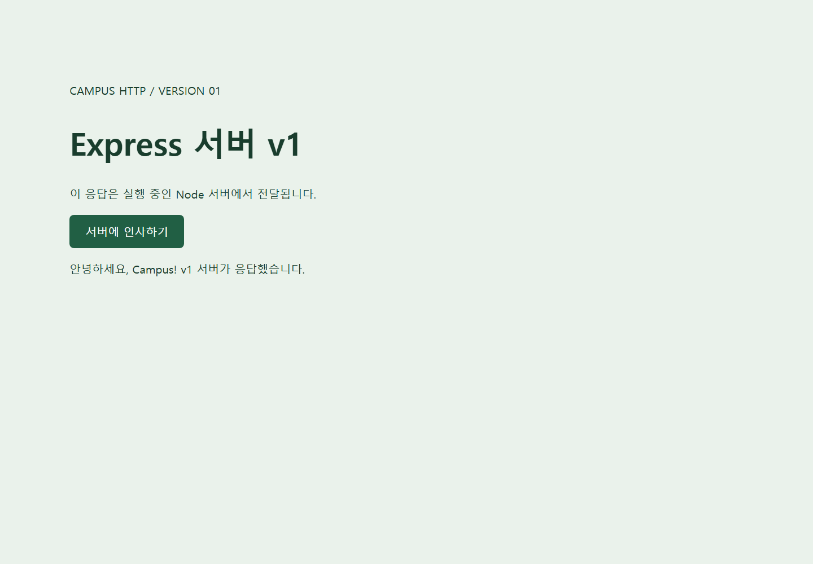
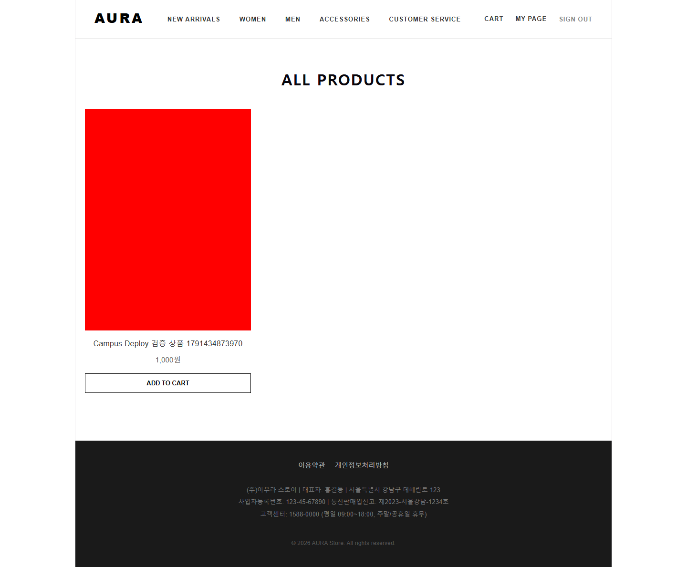
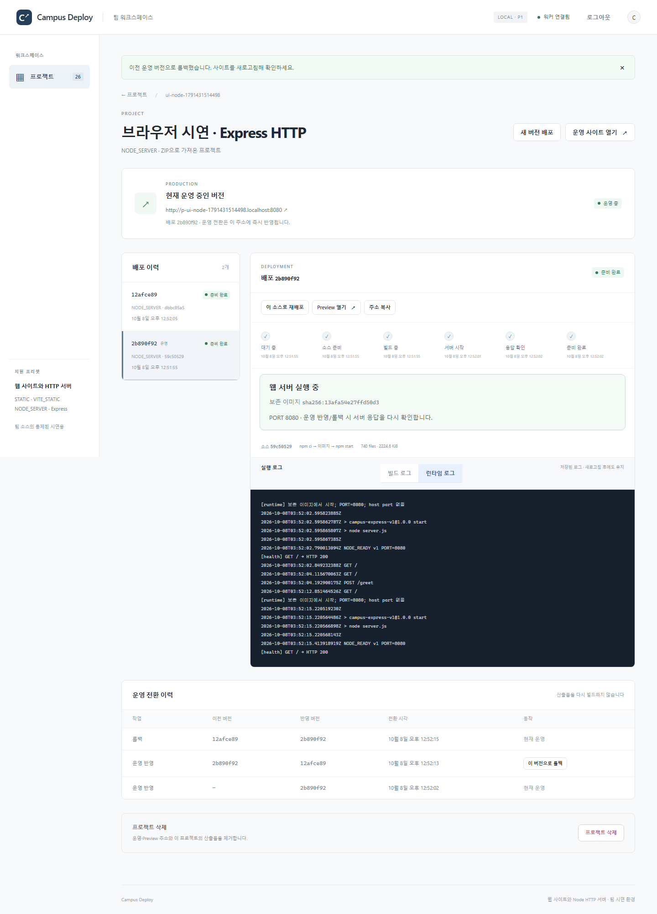

# Node / Spring 검증 증적 — 2026-10-08

Windows + Docker Desktop Linux/amd64에서 실행한 결과입니다. 암호·운영 SQLite·업로드 원본·Docker image tar는 포함하지 않았습니다. 전체 설명은 [VERIFICATION.md](../../VERIFICATION.md)를 참조하세요.

- [검증 요약](summary.json): pytest 94, Chromium 5, 기존 P0/Node 회귀 및 Spring 수명주기.
- [Spring GitHub 실제 배포](spring.json): aurashop SHA, Java image ID, frontend/API HTTP 검사.
- [Spring 데이터·롤백·컨테이너 누락 복구·삭제 격리](spring-lifecycle.json): 7개 실제 검사 PASS.
- [Spring 브라우저](browser-spring.json): 가입 API·로그인 UI·상품/장바구니·Redis token·이미지 픽셀 확인. 외부 주소 검색/결제 미검증.
- [GitHub 주소만 입력한 실제 배포](browser-github.json): 이름/slug 자동 입력, ZIP 없이 GIT 소스 배포, 실제 Chromium HTTP 200.
- [Node 배포·운영 전환·롤백·재시작](node-lifecycle.json).
- [운영 이미지 누락 및 자동 복구](node-recovery-failure.json): UNAVAILABLE/503 → 이미지 복원 → RUNNING, 재빌드 없음.
- [브라우저 실제 POST 및 운영 전환](browser-node.json).
- [SQLite·격리 설정·임시 자원 최종 감사](final-audit.json).

AWS/EC2, Ubuntu systemd boot, 외부 장비/공인 DNS는 미검증입니다. Windows OS의 `.localhost` 조회는 불안정했지만 Chromium은 resolver override 없이 실제 접속했습니다. 단일 설치의 Compose 재시작만 수행했으며 다른 Docker 프로젝트는 변경하지 않았습니다.
