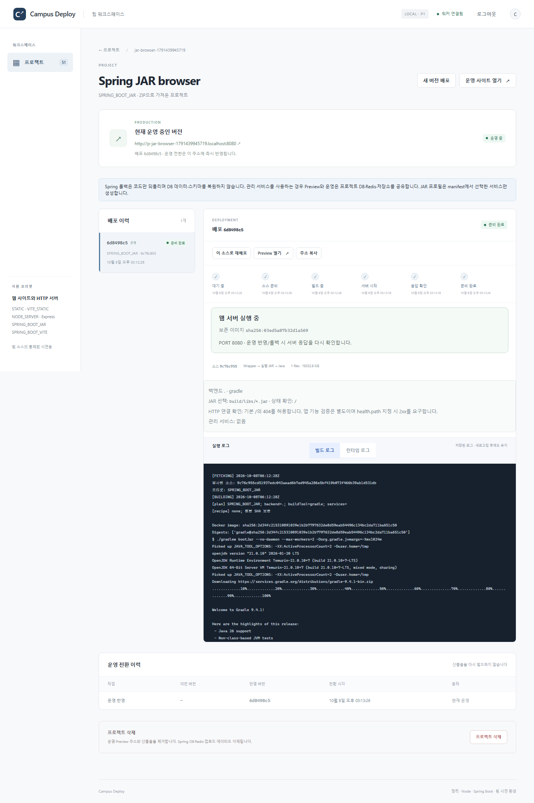
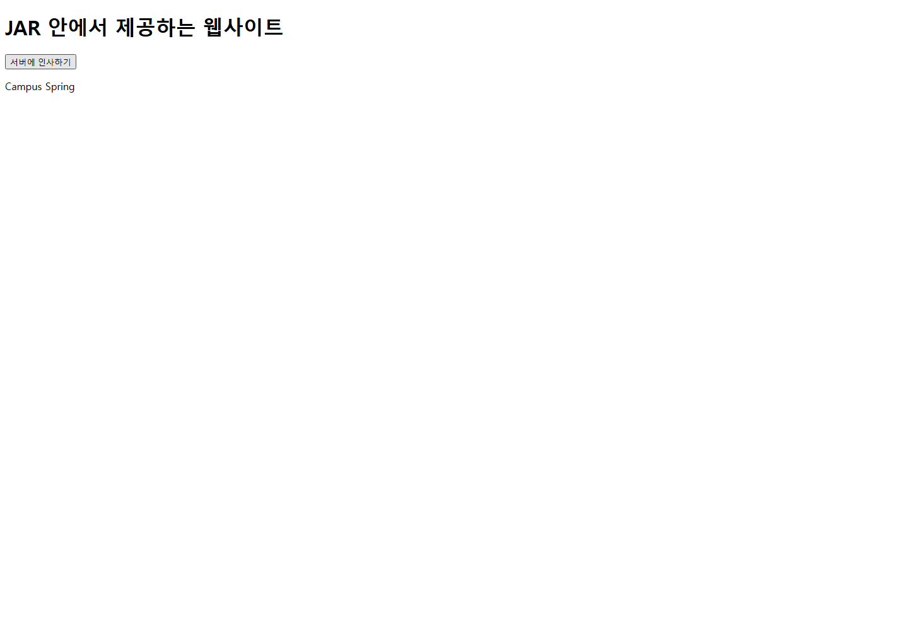

# Campus Deploy 검증 증적 — 2026-10-08

Windows + Docker Desktop Linux/amd64에서 실행한 결과입니다. 암호·운영 SQLite·업로드 원본·Docker image tar는 포함하지 않았습니다. 전체 설명은 [VERIFICATION.md](../../VERIFICATION.md)를 참조하세요.

- [최종 검증 요약](summary.json): 기준선 pytest 94/Chromium 5 → 최종 pytest 154/Chromium 6. 일반 JAR 11개·선택 서비스 4개·기존 aurashop 7개 실제 수명주기 검사.
- [자동 검사 원본](pytest-generalization.xml), [변경 전 기준선](pytest-before-generalization.xml), [브라우저 결과](playwright-generalization.json).
- [Gradle/Maven 일반 JAR](spring-jar.json): frontend 없는 API, 내장 웹, 이미지 rollback/복구, 실행 JAR 선택과 실패, 소유 자원 삭제. cleanup 실패를 수정 후 재검증한 경과를 포함합니다.
- [JAR 선택 서비스](spring-jar-services.json): MySQL·Redis·/app/state 실제 읽기/쓰기와 실패·재시작 후 데이터 보존, 해당 프로젝트 삭제.
- [JAR 실제 브라우저](browser-spring-jar.json): manifest 없는 웹앱, 서비스 자동 생성 없음, HTML/JS/API 버튼, 계획 및 코드 롤백 경고.
- [이전 단계 요약](summary-before-generalization.json): 앞서 수행한 P0/Node robustness·수명주기 이력. 이번에 동일 스크립트를 전부 재실행한 것으로 해석하지 않습니다.
- [Spring GitHub 실제 배포](spring.json): aurashop SHA, Java image ID, frontend/API HTTP 검사.
- [Spring 데이터·롤백·컨테이너 누락 복구·삭제 격리](spring-lifecycle.json): 기존 `SPRING_BOOT` 배포를 일반화한 코드로 다시 검사하여 7개 PASS.
- [Spring 브라우저](browser-spring.json): 가입 API·로그인 UI·상품/장바구니·Redis token·이미지 픽셀 확인. 외부 주소 검색/결제 미검증.
- [GitHub 주소만 입력한 실제 배포](browser-github.json): 이름/slug 자동 입력, ZIP 없이 GIT 소스 배포, 실제 Chromium HTTP 200.
- [Node 배포·운영 전환·롤백·재시작](node-lifecycle.json).
- [운영 이미지 누락 및 자동 복구](node-recovery-failure.json): UNAVAILABLE/503 → 이미지 복원 → RUNNING, 재빌드 없음.
- [브라우저 실제 POST 및 운영 전환](browser-node.json).
- [SQLite·격리 설정·임시 자원 최종 감사](final-audit.json).
- [업로드 비밀값 검사](publish-scan.json): Git 후보 파일을 현재 설치의 실제 관리자/서비스 비밀값과 대조한 결과. 값은 출력하거나 문서에 포함하지 않습니다. 모든 형태의 비밀 유출을 판별하는 범용 감사는 아닙니다.

최종 감사에서 SQLite integrity ok, work/staging 비어 있음, 잔존 builder/작업 볼륨 0, 서버 runtime 32개의 격리 설정을 확인했습니다. 마지막 임시 폴더 복구 보강 후 pytest·실제 startup·audit·JAR 브라우저 버튼을 확인했습니다. 전체 6개 E2E는 그 보강 직전에 통과했으며 실행 순서는 summary에 기록합니다.

AWS/EC2, Ubuntu systemd boot, 외부 장비/공인 DNS는 미검증입니다. Windows OS의 `.localhost` 조회는 불안정했지만 Chromium은 resolver override 없이 실제 접속했습니다. 단일 설치의 Compose 재시작과 지정 runtime/서비스 컨테이너 재생성을 수행했으며 다른 Docker 프로젝트는 변경하지 않았습니다. 삭제 검사용 시험 프로젝트는 검증 후 삭제되었으므로 증적 URL이 모두 영구 제공되는 것은 아닙니다.
